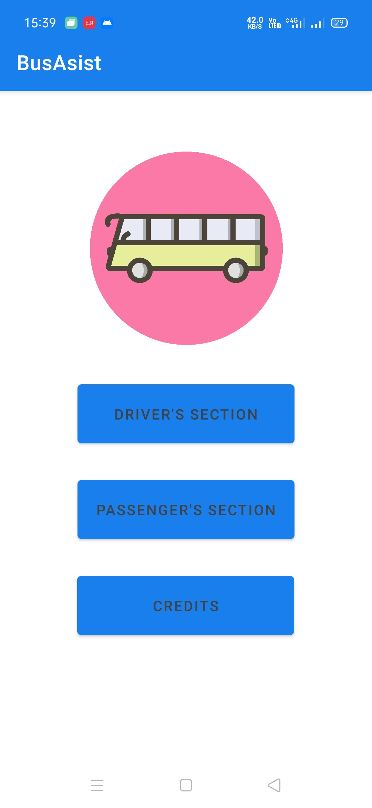
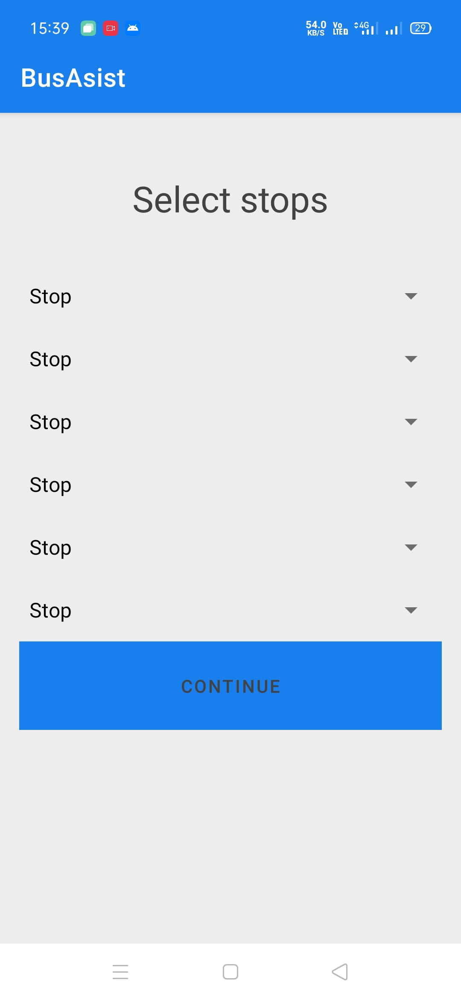
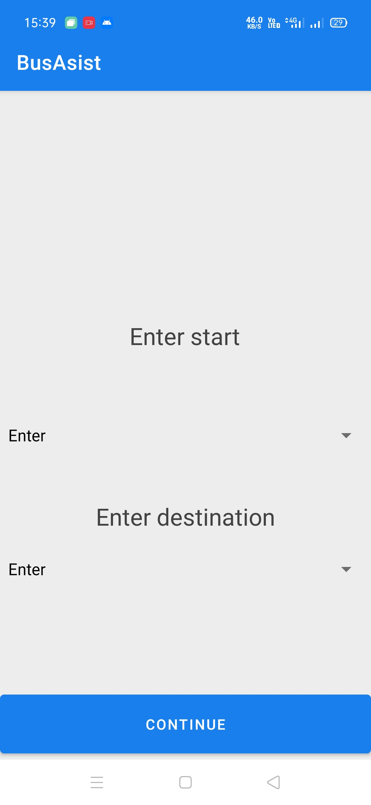
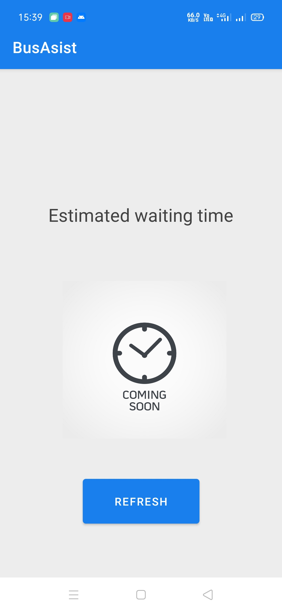
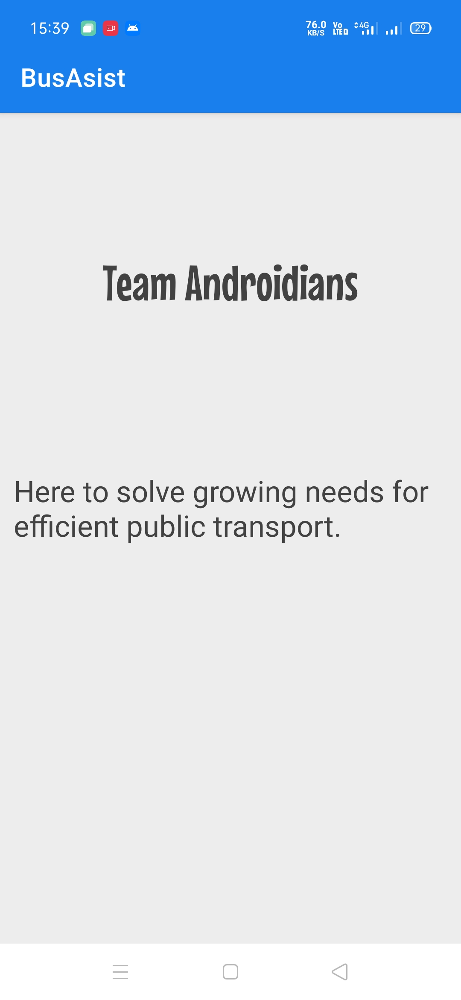

# BusAsist-Hackcbs
A project for Hackathon HACKCBS by TEAM-Androidians

This app is the solution to improve the efficiency of public transport. The main reason people don't prefer public transport is delays, sometimes the vehicle don't come at all. The app has 2 section one for driver's i.e bus and other for passengers. The driver's section is used to get the route of bus and it UPDATES the location of bus at an interval 10 sec. The passenger needs to enter source and destination of journey and they'll get the exact time that bus would take to arrive at the source of the journey.

Suppose the passenger needs to travel from A to B. Then he/she would get the estimated time that bus would take to arrive at A. Thus improving the efficiency of public transport.
<i float = "left">
  

</i>

